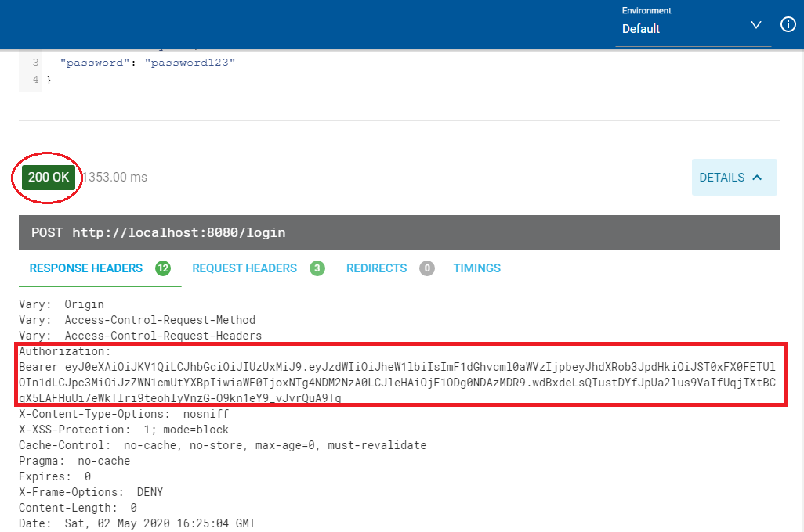
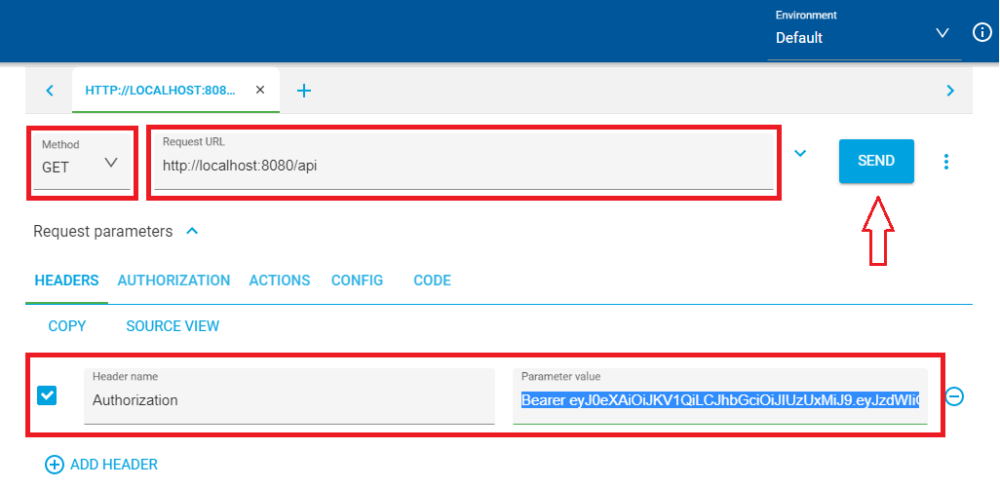
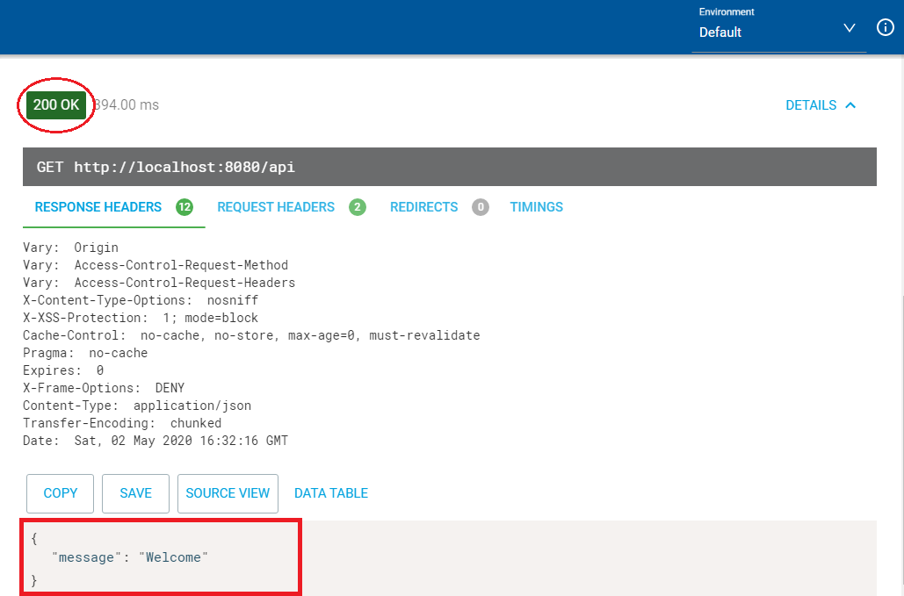

# Spring Boot + JWT + Spring Security + MongoDB
#### In this project we've used the JWT token-based authentication with Spring Security on a RESTful APIs written with Spring Boot.
#### In a nutshell, JSON Web Tokens, commonly known as JWTs, are tokens that are used to authenticate users on applications. They enable backends to accept requests simply by validating the contents of these JWTS, which means that whenever the user wants to access a protected route or resource (an endpoint), the user agent must send the JWT (the token), usually in the Authorization header along with the request.
## Prerequisites
```
JDK 1.8 or later
MongoDB (4.2)
Apache Maven 3.6.3
```
## Setting up the project
### 1. Installing
Download and unzip the source repository for this guide, or clone it using Git:
```
git clone https://github.com/Aymen0x0/spring-boot-security-jwt.git
```
 ### 2. Database Configuration
 #### Create MongoDB database
 ```
 use securityapp
 ```
### 3. Build and run the application
You can run the application by using 
```
mvn spring-boot:run
```
Alternatively, you can build the JAR file with
```
mvn clean package
``` 
and then run the JAR file, as follows:
```
java -jar target/<generated-jar-file>.jar
```
## Testing the application
To authenticate, we should make a request to ```http://localhost:8080/login``` if the credentials are correct, we’ll get an HTTP status 200 response and the token generated by the server included in the headers.
So, make sure that you pass the credentials inside the body section of the request.


Now that we have the token that confirms our identity we can consume secured endpoints.



This time we’ll send a request to ```http://localhost:8080/api``` with a GET method, but we have to add the token to the headers. For this we’re going to put the word ```Authorization``` as an identifier and the token next to it.



If the token is correct, then we’ll get a 200 response status and also a simple message returned by the endpoint as shown below.



## Author
* **Aymen Mankari** - [Aymen0x0](https://github.com/Aymen0x0)
